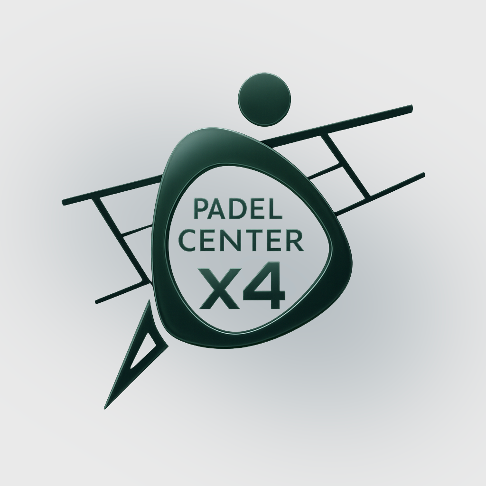

<div align="center">

# 🎾 PadelCenter

**La plataforma definitiva para gestionar partidos de pádel**

[](https://flutter.dev)
[](https://dart.dev)
[](https://supabase.com)

[](https://github.com/tu-usuario/padelcenter/actions)
[](https://github.com/tu-usuario/padelcenter/releases/latest)
[](LICENSE)



*Conecta, juega y compite en el mundo del pádel*

</div>

---

## ✨ Características

🎯 **Gestión de Partidos** • 👥 **Perfiles Personalizables** • 🔒 **Autenticación Segura** • 📱 **Multiplataforma**

---

## 🚀 Descargas

[](https://github.com/tu-usuario/padelcenter/releases/latest/download/PadelCenter-v1.0.0-universal.apk)
[](https://github.com/tu-usuario/padelcenter/releases/latest)
[]([https://tu-usuario.github.io/padelcenter/](https://anubisreal.github.io/padelcenter))

### 🛠️ Desarrollo Local

```bash
git clone https://github.com/tu-usuario/padelcenter.git
flutter pub get && dart run flutter_launcher_icons
flutter run
```

---

## 🤝 Contribuir

[](CONTRIBUTING.md)
[](https://github.com/tu-usuario/padelcenter/issues)
[](https://github.com/tu-usuario/padelcenter/pulls)

---

<div align="center">

[](https://opensource.org/licenses/MIT)

### 💫 Hecho con ❤️ por el equipo de PadelCenter

[](https://github.com/tu-usuario)
[](https://twitter.com/tu-usuario)

</div>
